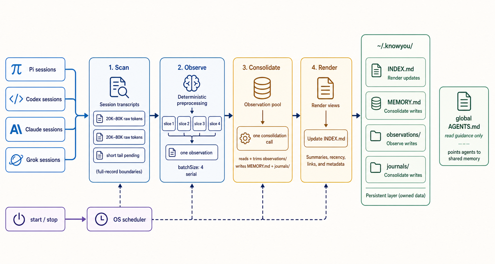

<p align="center">
  
</p>

<h1 align="center">knowyou</h1>

<p align="center">Quiet, shared memory for every AI agent.</p>

knowyou is a non-intrusive, agent-agnostic memory layer for Pi, Codex, Claude, and Grok. It runs in the background, distilling and consolidating session context into shared Markdown—so every agent knows why it is here, what matters next, and how you like to work.



## Quick start

Requires [Pi](https://github.com/earendil-works/pi) to be installed and working. Pi runs the background distillation; session adapters cover Pi, Codex, Claude, and Grok.

```bash
npx knowyou@latest start
npx knowyou@latest stop
```

`start` registers the background job; `stop` removes it.

If you want an agent to read the memories, add these lines to its global instructions file—for example Pi’s `~/.pi/agent/AGENTS.md`, Codex’s `~/.codex/AGENTS.md`, or the equivalent file for another agent:

```markdown
- Read ~/.knowyou/INDEX.md for recent observations
- Read ~/.knowyou/MEMORY.md for durable memory and preferences
- Search ~/.knowyou/journals/ by keyword when older context is needed
- Never edit, delete, or write files under ~/.knowyou/
```

## Persistent memory

The OS runs knowyou periodically. There is no resident server or database—just durable files under `~/.knowyou/`:

```text
~/.knowyou/
├── INDEX.md             # recent observations, one line per entry
├── MEMORY.md            # consolidated long-term memory and preferences
├── observations/       # new distilled memories waiting to be consolidated
├── journals/            # older memory moved out of MEMORY.md
├── .state.json          # incremental scan watermarks and run state
├── config.yaml          # optional settings and overrides
└── launchd.log          # background job output
```

## Defaults and configuration

Here, `agent` means the background Pi runner that distills observations and consolidates memory—not the agents whose sessions are being read. No knowyou configuration is required when Pi works; it uses the model and reasoning effort configured in your Pi agent by default.

To override only the settings you care about, create `~/.knowyou/config.yaml`:

```yaml
agent:
  model: provider/model       # optional; otherwise Pi's default
  thinking: medium            # optional; otherwise Pi's default

scan:
  windowDays: 7
  minNewTokens: 20000         # estimated raw transcript tokens before preprocessing
  maxNewTokens: 200000        # estimated raw tokens per session slice
  redactSecrets: true

observe:
  # each slice is compacted to <=10K tokens and observed alone;
  # the complete observation request stays below 12K

consolidate:
  triggerObservations: 30
  maxMemoryChars: 20000
```

Token counts are estimates using UTF-8 bytes divided by four. Each scan slice is compacted
deterministically to at most 10K estimated tokens, then observed in its own serial Pi call;
instructions and metadata keep the complete request below 12K.

Check the current state with:

```bash
npx knowyou@latest status
```

Repository E2E tests always use the real Pi provider and local real-session corpus:

```bash
npm run test:e2e
```

Reviewable redacted compacted traces, observations, memory, journals, state, corpus
receipts, and CLI logs are written to the gitignored `e2e-results/` directory. Raw
session files remain in their original harness stores and are never copied there.

All state stays under `~/.knowyou/`. Model requests go through Pi and its normal provider/authentication.

## Supported sessions

- Pi
- Codex
- Claude
- Grok
